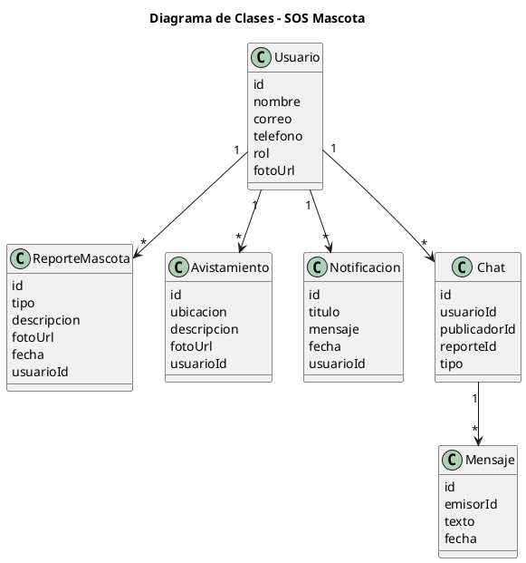

# 🐾 SOS Mascota  
### Aplicación Móvil Inteligente de Rescate y Localización de Mascotas


---

## 📱 Descripción General

**SOS Mascota** es una aplicación móvil desarrollada en **Flutter** con **Firebase** y **TensorFlow Lite**, diseñada para ayudar a **reportar, encontrar y rescatar mascotas perdidas** en la ciudad.  
La aplicación utiliza **inteligencia artificial (IA)** para detectar el tipo de animal (perro, gato u otro) a partir de imágenes y permite una **comunicación directa** entre usuarios mediante un chat en tiempo real.

El proyecto está enfocado en la **colaboración ciudadana y tecnológica**, integrando visión por computadora, mapas interactivos y notificaciones push, para crear una red de apoyo al rescate animal.

---

## 🧩 Arquitectura del Proyecto (MVVM)

El sistema se desarrolló bajo el patrón **MVVM (Model - View - ViewModel)**, garantizando separación de responsabilidades, mantenibilidad y escalabilidad del código.  

```
lib/
├── modelo/               → Clases de dominio (Usuario, Reporte, Avistamiento, Notificación, Chat)
├── servicios/            → Comunicación con Firebase, TFLite, API DNI, Notificaciones
├── vista/                → Interfaces gráficas (Login, Mapa, Reportes, Chat, Perfil)
└── vistamodelo/          → Lógica de negocio (AuthVM, ReporteVM, ChatVM, PerfilVM, etc.)
```

---

## ⚙️ Tecnologías Utilizadas

| Componente | Descripción |
|-------------|--------------|
| **Flutter 3.24** | Framework principal para desarrollo móvil multiplataforma |
| **Firebase Auth & Firestore** | Autenticación y almacenamiento en tiempo real |
| **Firebase Cloud Messaging (FCM)** | Envío de notificaciones push |
| **TensorFlow Lite (TFLite)** | Detección y comparación de animales por IA |
| **Provider (MVVM)** | Gestión de estado y desac acoplamiento |
| **Google Maps / OpenStreetMap** | Visualización de ubicaciones de reportes |
| **Firebase Storage** | Almacenamiento de imágenes |
| **Lottie Animations** | Animaciones fluidas y modernas |
| **API RENIEC / DNI** | Verificación de identidad ciudadana |

---

## 🧠 Funcionalidades Principales

### 👤 Autenticación y Usuario
- Registro, login y cierre de sesión con correo y contraseña.  
- Recuperación y verificación de cuenta.  
- Perfil editable con avatar e información de contacto.

### 🐶 Reporte de Mascotas
- Crear reportes de **mascotas perdidas o encontradas**.  
- Adjuntar imágenes, descripción y ubicación en el mapa.  
- Editar o cancelar reportes activos.  
- Visualizar reportes cercanos en tiempo real.

### 👀 Avistamientos
- Registrar avistamientos de mascotas en la vía pública.  
- Ubicar los puntos en un mapa interactivo.  
- Consultar detalles e imágenes asociadas.

### 🤖 Inteligencia Artificial (TFLite)
- Clasificación automática de imágenes: *gato*, *perro* u *otro*.  
- Comparación de similitud entre dos fotos (por ejemplo, para confirmar si se trata de la misma mascota).  

### 💬 Chat en Tiempo Real
- Comunicación directa entre el publicador y otros usuarios.  
- Envío y recepción instantánea de mensajes con Firestore.  
- Notificaciones push al recibir mensajes nuevos.

### 🔔 Notificaciones
- Alertas automáticas cuando se publica un nuevo reporte o mensaje.  
- Integración con **Firebase Cloud Messaging (FCM)**.

---

## 🧱 Diagrama de Clases (Simplificado)



---

## 🚀 Instalación y Ejecución

### 1️⃣ Clonar el repositorio
```bash
git clone https://github.com/dennisdhm7/SOSMascota.git
cd SOSMascota
```

### 2️⃣ Instalar dependencias
```bash
flutter pub get
```

### 3️⃣ Configurar Firebase
- Descarga el archivo `google-services.json` desde tu consola de Firebase.  
- Colócalo en la ruta:  
  `android/app/google-services.json`

### 4️⃣ Ejecutar la aplicación
```bash
flutter run
```

---

## 🧪 Capturas de Pantalla

| Login | Reporte | Mapa | Chat |
|:-----:|:--------:|:----:|:----:|
|  |  |  |  |

*(Reemplaza las imágenes por tus capturas reales o assets de `screenshots/`)*

---

## 👥 Equipo de Desarrollo

| Nombre | Rol | Función |
|--------|------|----------|
| **Christian Dennis Hinojosa Mucho** | Desarrollador Principal | Arquitectura, IA y Firebase |
| **Julio y Kenji** | Soporte Técnico | Validación y mantenimiento |
| **Ing. Lanchipa** | Supervisor Académico | Evaluación y control del proyecto |

---


## 🌍 Información Académica

📚 **Curso:** Construcción de Software I
🏫 **Universidad:** Universidad Privada de Tacna –  
📅 **Periodo Académico:** 2025-II  
💻 **Proyecto:** Aplicación Flutter + Firebase + IA – "SOS Mascota"

---

> “Cada reporte cuenta, cada rescate importa.” 🐕💙  
> Desarrollado con Flutter, Firebase y TensorFlow Lite.  
